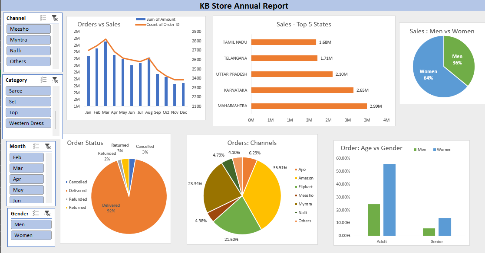

# 📊 KB Store Annual Sales Analysis Dashboard

An Excel-based Business Intelligence project focused on analyzing annual retail sales performance, customer demographics, order trends, sales channels, and regional contributions for KB Store.

The project leverages Excel's analytical capabilities including Pivot Tables, Pivot Charts, Slicers, and Dashboard Design to transform raw sales data into meaningful business insights.

---

## 🚀 Project Overview

The objective of this project was to analyze KB Store's annual sales data and identify key business trends related to revenue generation, customer behavior, order fulfillment, and sales channel performance.

An interactive dashboard was developed to help stakeholders make data-driven decisions through visual analytics and KPI tracking.

---

## 📌 Analysis Performed

### Sales vs Orders Analysis
- Compared monthly sales revenue and order volume using a combined chart.
- Identified overall sales trends throughout the year.

### Monthly Performance Analysis
- Analyzed month-wise sales and order distribution.
- Determined peak-performing months.

### Gender-Based Purchase Analysis
- Compared purchasing contribution of Men and Women customers.
- Evaluated customer demographic trends.

### Order Status Analysis
- Examined order fulfillment performance.
- Analyzed Delivered, Cancelled, Returned, and Refunded orders.

### Top Performing States
- Identified the highest revenue-contributing states.
- Evaluated geographic sales distribution.

### Age vs Gender Analysis
- Analyzed customer purchasing patterns across:
  - Adults
  - Seniors
  - Teenagers
- Compared buying behavior by gender.

### Channel Performance Analysis
- Evaluated sales contribution from:
  - Amazon
  - Flipkart
  - Myntra
  - Ajio
  - Other channels

### Product Category Analysis
- Identified top-selling categories.
- Evaluated category-wise business performance.

---

## 🛠️ Tools Used

- Microsoft Excel
- Pivot Tables
- Pivot Charts
- Slicers
- Dashboard Design
- Data Cleaning
- Business Intelligence Reporting
- Data Visualization

---

## 📂 Dataset Features

The dataset contains:

- Customer Information
- Age & Gender Data
- Order Details
- Sales Revenue
- Product Categories
- Sales Channels
- Order Status
- Geographic Information
- Monthly Sales Data

---

## 📊 Dashboard Features

- Monthly Sales vs Orders Analysis
- Gender-Based Revenue Analysis
- Order Status Distribution
- Top Revenue-Contributing States
- Age & Gender Insights
- Sales Channel Contribution
- Interactive Filtering and Visualization

---

## 📈 Key Insights

- Women customers contributed significantly higher sales compared to men.
- Amazon emerged as one of the highest-performing sales channels.
- Maharashtra and Karnataka were among the top revenue-generating states.
- Delivered orders represented the majority of transactions.
- Adult customers formed the largest purchasing segment.
- Monthly analysis revealed clear seasonal sales patterns.

---

## 📸 Dashboard



---

## 🎯 Skills Demonstrated

- Data Cleaning
- Exploratory Data Analysis (EDA)
- Dashboard Development
- Business Intelligence
- KPI Analysis
- Data Visualization
- Retail Sales Analytics
- Excel Reporting

---

## 📂 Repository Structure

```bash
KB-Store-Annual-Sales-Analysis/
│
├── KB Store Data Analysis.xlsx
├── README.md
└── screenshots/
    └── dashboard.png
```

---

## 👨‍💻 Author

**Karan Bisht**

---

## 📜 License

This project is licensed under the MIT License.